# MealBuddy App

## 📌 Overview
MealBuddy is an Android app that helps users plan their meals, discover new recipes, and manage their favorites. It integrates **TheMealDB API** for recipe inspiration, supports **meal planning**, and syncs data across devices using **Firebase**.

## Features
- **Meal of the Day** for daily inspiration.
- **Search meals** by category, country, or ingredient.
- **Favorite meals** and store them locally using **Room**.
- **Meal Planning** to organize meals for the future.
- **Sync & Backup** favorites and meal plans via **Cloud Firestore**.
- **Authentication** with Google **Firebase**.
- **Meal Details**: Name, image, country, ingredients (with images), steps, and a video.
- **Offline Support**: Access saved meals and plans without an internet connection.
- **Optimized Performance** with **RxJava & MVP architecture**.

## 📱 Screenshots
<div align="center">
  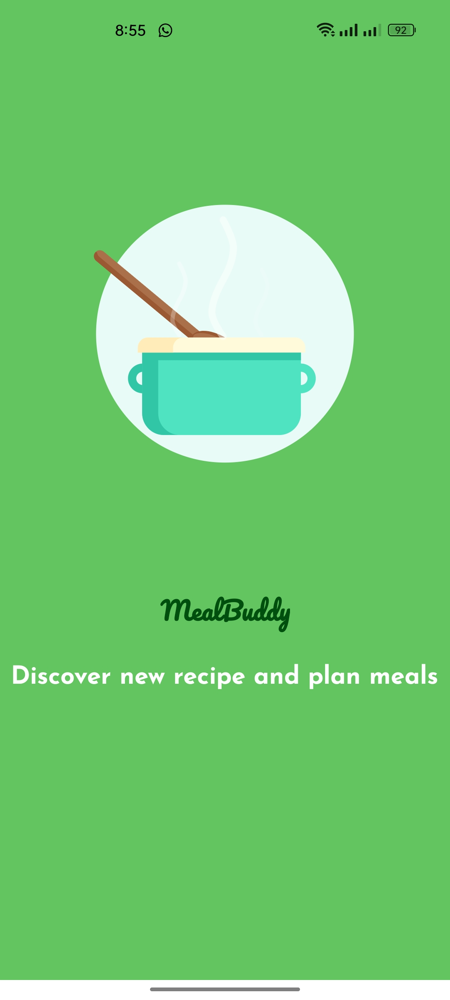
  
  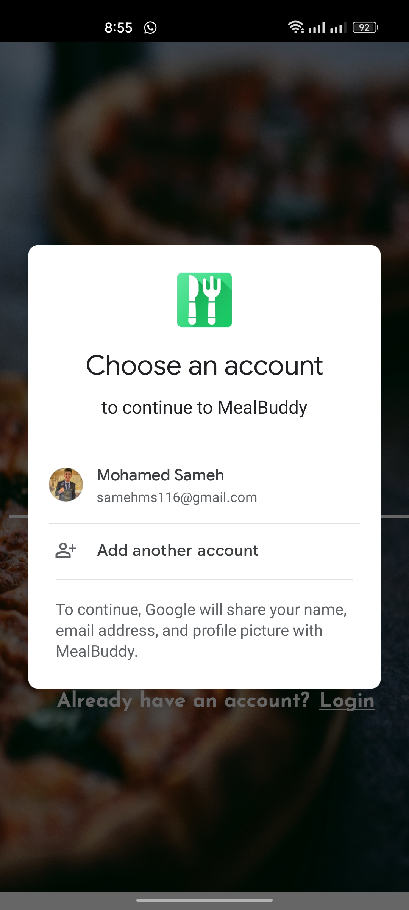
  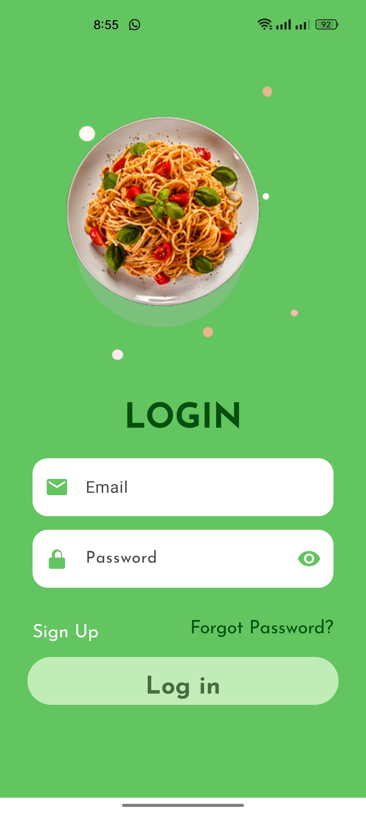
  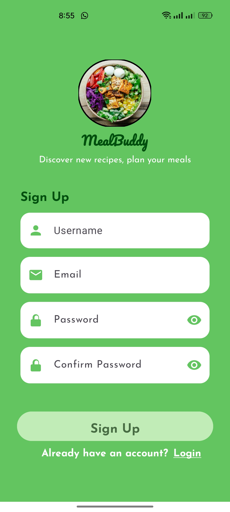
  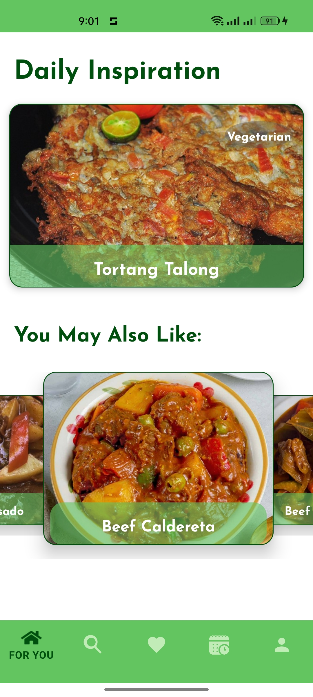
  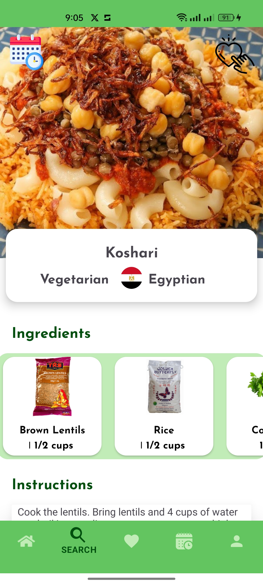
  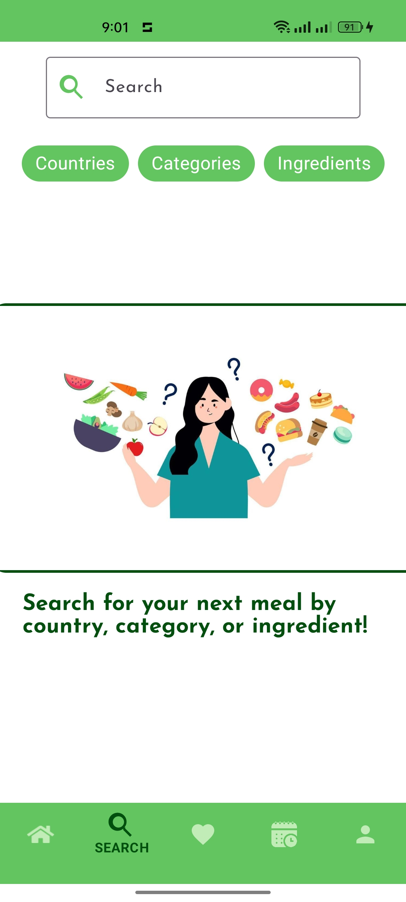
  
  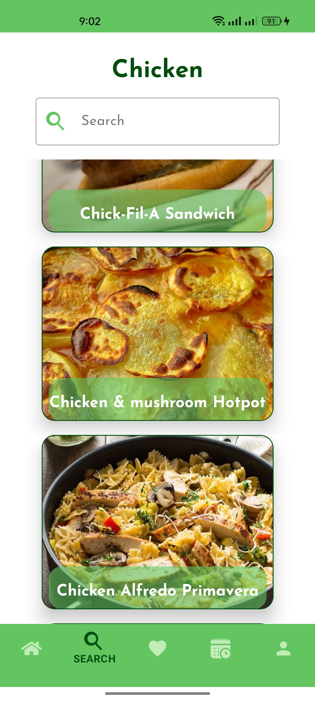
  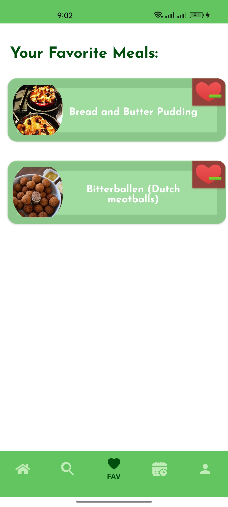
  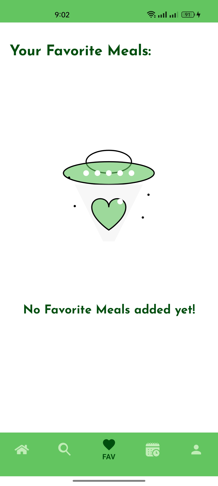
  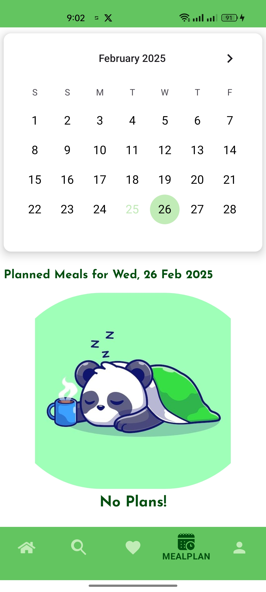
  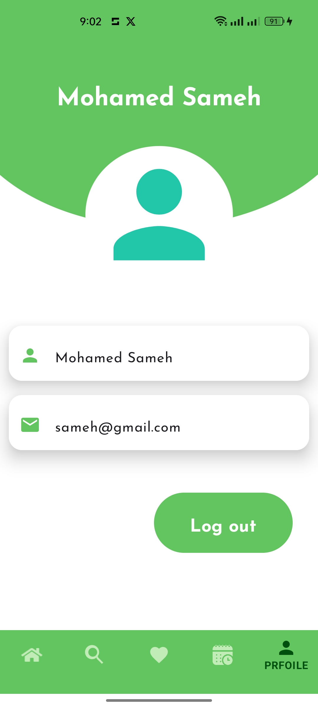
  
  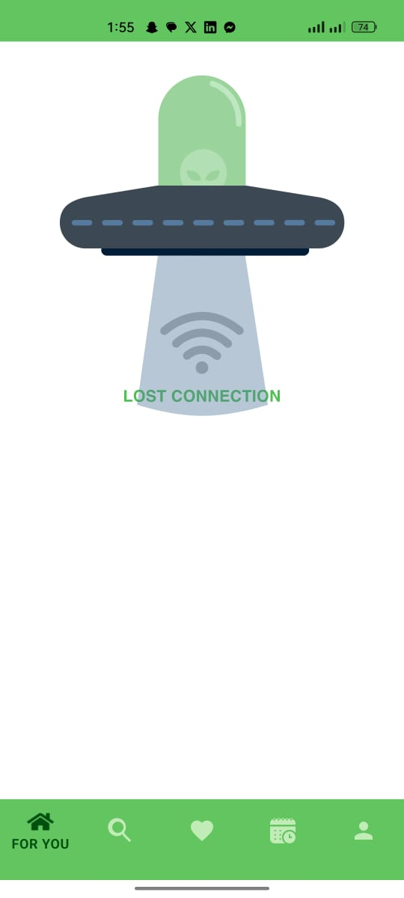
  
</div>

## 🏗️ Architecture
- **MVP (Model-View-Presenter) Architecture** for better maintainability.
- **Repositories** to manage local (Room) and remote data.
- **RxJava** for reactive programming and async operations.

## 🔧 Tech Stack
- **Language:** Java 
- **Framework:** Android SDK 
- **Database:** Room (local storage) 
- **Backend:** Firebase (Auth + Firestore)
- **API:** TheMealDB 
- **Networking:** Retrofit 
- **Asynchronous Handling:** RxJava 
- **UI:** Jetpack Components 

## 🛠️ Setup & Installation
1. **Clone the repository:**
   ```sh
   git clone https://github.com/MasameEh/FoodPlanner.git
   cd FoodPlanner
   ```
2. **Open in Android Studio** and sync Gradle.
3. **Add API Keys**:
   - Set up Firebase and add `google-services.json` to the `app/` folder.
4. **Run the app** on an emulator or device.


